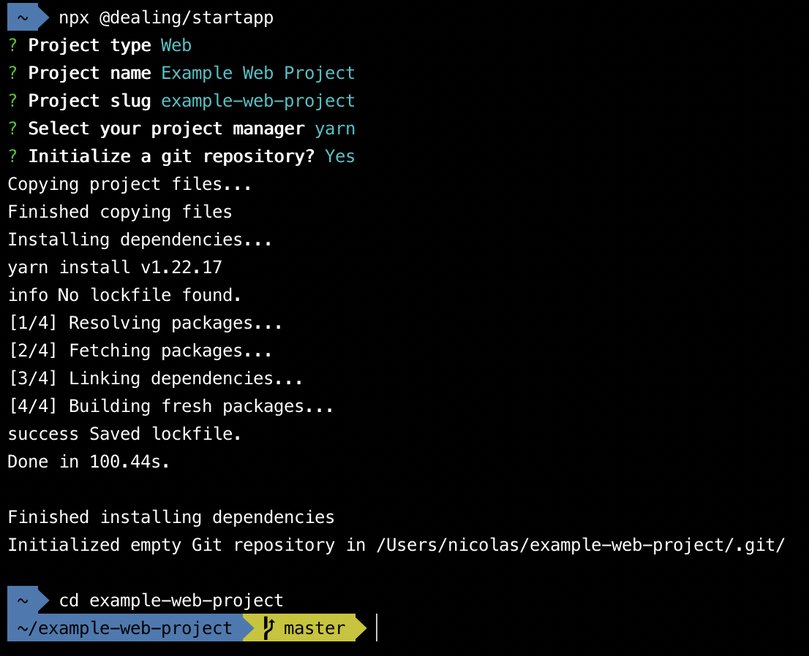

------

## Getting Started

Just run:

`npx @dealing/startapp`

and answer the questions, then, you will be good to go with a production-ready application, either for a web or backend application.

## Optional arguments

|  Parameter  | Alias |      Options      |                                     Description                                    |
|:-----------:|:-----:|:-----------------:|:----------------------------------------------------------------------------------:|
|   `--type`  |  `-t` | `web` \| `server` |                      The type of application you want to start                     |
| `--manager` |  `-m` |  `npm` \| `yarn`  |   Your package manager. Only will be considered if you selected a web application  |
|   `--git`   |  `-g` |         -         | If you want us to start a git repository in your new application (runs `git init`) |

## Templates

### Web

Our web template is built over [Create React App](https://create-react-app.dev/), with our custom configurations, which include:

- [TypeScript](https://www.typescriptlang.org/)
- [Eslint](https://eslint.org/)
- [Stylelint](https://stylelint.io/)
- [Sentry](https://sentry.io/welcome/)
- [Jest](https://jestjs.io/)
- [Material UI](https://mui.com/)
- [Axios](https://axios-http.com/docs/intro)
- Github Actions workflow

#### Known issues

There is a problem using npm as a project manager, we are working to fix our dependencies to provide this popular project manager. We strongly recommend to use `yarn` while we work on this :)

### Backend

Our web template is built over [Django Cookiecutter](https://github.com/cookiecutter/cookiecutter-django), with custom configurations, which include:

- Dockerized app
- Slack integration
- Production ready `docker-compose.yml`, ready to use with AWS Elastic Beanstalk and other services
- Github Actions workflow
- Nginx for production Reverse Proxy and Load Balancing

#### To continue

Find all and replace the following ocurrencies:

- `backend_template`: with your project name for your main folder.
- `Backend Template`: with your project name.
- `example.com`: with your own domain.

We are working to automate this process :)

## Example installation workflow

## Disclosure

This project is strongly base on the code and tutorial provided in [this webpage](https://www.twilio.com/blog/how-to-build-a-cli-with-node-js).
